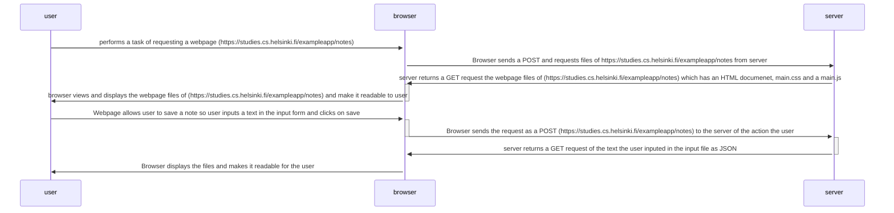

```mermaid
sequenceDiagram
    user->>+browser: performs a task of requesting a webpage (https://studies.cs.helsinki.fi/exampleapp/notes)
    browser->>server:Browser sends a POST and requests files of https://studies.cs.helsinki.fi/exampleapp/notes from server
    activate server
    server->>browser:server returns a GET request the webpage files of (https://studies.cs.helsinki.fi/exampleapp/notes) which has an HTML documenet, main.css and a main.js 
    activate browser
    browser->>user:browser views and displays the webpage files of (https://studies.cs.helsinki.fi/exampleapp/notes) and make it readable to user
    deactivate browser

    user->>browser: Webpage allows user to save a note so user inputs a text in the input form and clicks on save
    activate browser
    browser->>server: Browser sends the request as a POST (https://studies.cs.helsinki.fi/exampleapp/notes) to the server of the action the user
    deactivate browser

    activate server
    server->>browser: server returns a GET request of the text the user inputed in the input file as JSON
    deactivate server

    activate browser
    browser->>user: Browser displays the files and makes it readable for the user


```