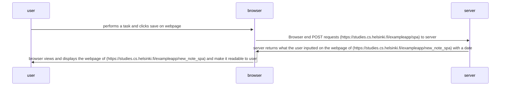

```mermaid
sequenceDiagram
    user->>+browser: performs a task and clicks save on webpage 
    browser->>server:Browser end POST requests (https://studies.cs.helsinki.fi/exampleapp/spa) to server
    activate server
    server->>browser:server returns what the user inputted on the webpage of (https://studies.cs.helsinki.fi/exampleapp/new_note_spa) with a date
    activate browser
    browser->>user:browser views and displays the webpage of (https://studies.cs.helsinki.fi/exampleapp/new_note_spa) and make it readable to user
    deactivate browser
```
